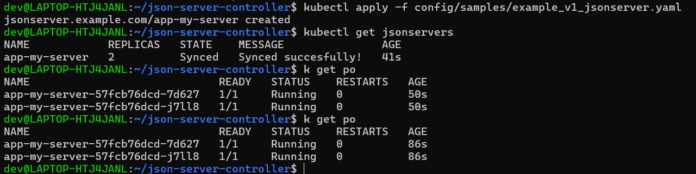
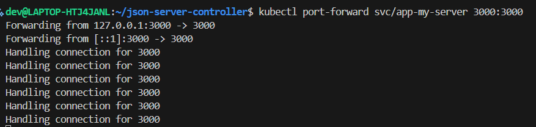
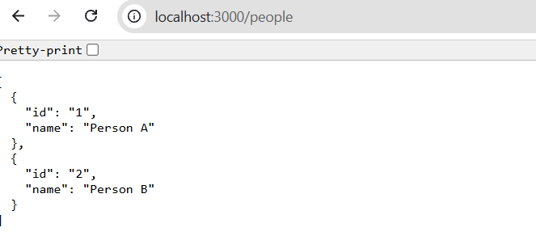

# json-server-controller

Kubernetes controller that manages simple json-server instances via a CustomResourceDefinition (CRD).

This repository implements a Kubebuilder-based controller and admission webhook for a `JsonServer` resource. The controller ensures a running Deployment, Service and ConfigMap for each `JsonServer` and keeps Status updated. The webhook enforces name and JSON validation rules.

## Table of contents

- Features
- Architecture
- CRD (fields & example)
- Quickstart
- Development (build & run locally)
- Testing
- Samples & images
- Contributing

## Features

- CRD: `JsonServer` (example.com/v1)
- Controller creates and reconciles:
  - Deployment (runs json-server)
  - Service (exposes port 3000)
  - ConfigMap (contains JSON data served by json-server)
- Admission webhook validates:
  - resource name starts with `app-`
  - `jsonConfig` is valid JSON
- Status reporting: `Synced` / `Error`
- Supports scaling via `kubectl scale` and reconciliation

## Architecture

- Controller (Reconciler) watches `JsonServer` resources and ensures associated Kubernetes objects (Deployment, Service, ConfigMap) exist and match the spec.
- Webhook validates incoming create/update requests for naming and JSON validity.
- Example code lives under `api/v1` and controller implementation is in `internal/controller`.

## CRD: schema and example

Key fields on `spec`:

- `replicas` (int): desired number of replicas for the json-server Deployment
- `jsonConfig` (string): raw JSON content served by the json-server process via a ConfigMap

Example resource (short):

```yaml
apiVersion: example.com/v1
kind: JsonServer
metadata:
  name: app-my-server
spec:
  replicas: 2
  jsonConfig: |
    {
      "people": [
        {"id": 1, "name": "John"},
        {"id": 2, "name": "Jane"}
      ]
    }
```

Full sample manifests are available in `samples/` (see `samples/example_v1_jsonserver.yaml`).

## Quickstart

Prerequisites:

- Go 1.21+
- Docker
- A local Kubernetes cluster (kind, k3d, minikube)
- kubectl

Steps:

1. Create a local cluster (example using kind):

```bash
kind create cluster
```

2. Install the CRD into the cluster:

```bash
make install
```

3. Run the controller locally (without webhook):

```bash
ENABLE_WEBHOOKS=false make run
```

4. Apply a sample JsonServer resource:

```bash
kubectl apply -f config/samples/example_v1_jsonserver.yaml
```

5. Verify:

```bash
kubectl get jsonservers
kubectl get deploy,svc,cm -l app=jsonserver
kubectl port-forward svc/app-my-server 3000:3000
curl http://localhost:3000/people
```

## Development

- Build the controller image:

```bash
make docker-build IMG=ttl.sh/json-server-controller:dev
```

- Push image (optional):

```bash
make docker-push IMG=ttl.sh/json-server-controller:dev
```

- Deploy controller to cluster:

```bash
make deploy IMG=ttl.sh/json-server-controller:dev
```

- Run unit tests:

```bash
go test ./... -v
```

## Testing & Validation

- Controller unit tests live under `internal/controller` (see `jsonserver_controller_test.go`).
- Webhook tests are under `api/v1` (`jsonserver_webhook_test.go`).
- You can run the full test suite with `go test ./...`.

## Samples & images

- Sample manifests: `samples/` (multiple example YAMLs are provided including invalid cases for testing validation).
- Result images and screenshots are stored in `imgs/` for documentation and verification. Current images in repository:

  - `imgs/image.png`
  - `imgs/image-02.png`
  - `imgs/image-03.png`

Include these images in PRs or docs when you want to show controller/webhook behavior and test results.

### Image gallery

Below are the current result screenshots stored in the `imgs/` directory. These are referenced with relative paths so they render on GitHub and in other Markdown viewers.

<p align="center">
  
  <br/>
  <em>Figure 1: Example controller run / test result</em>
</p>

<p align="center">
  
  <br/>
  <em>Figure 2: Additional verification or test output</em>
</p>

<p align="center">
  
  <br/>
  <em>Figure 3: Webhook/validation screenshot</em>
</p>

## Contributing

- Fork, create a branch, and open a PR with a clear description.
- Run tests locally and ensure `make test` (if present) or `go test ./...` pass.

## Cleanup

```bash
kubectl delete jsonservers --all
make undeploy
make uninstall
kind delete cluster
```

## License

This project is provided under the terms in the `LICENSE` file (if present).

---

If you'd like I can also add a small `README-images.md` that embeds the screenshots from `imgs/` for easier review — tell me if you'd like that and which images to highlight.
